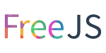
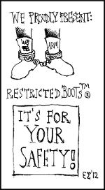
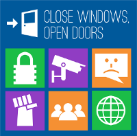
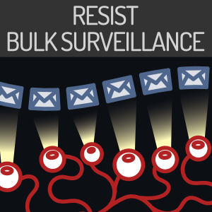
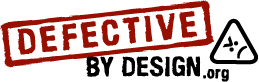
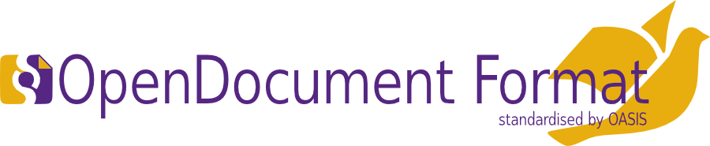
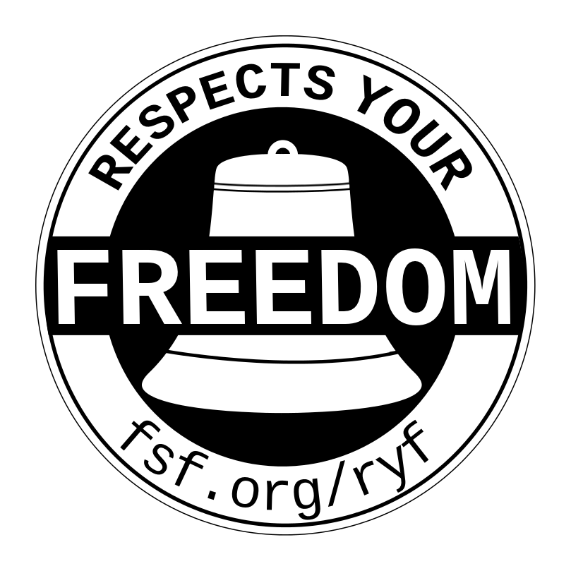

..
  Copyright 2014  Fraser Tweedale.

  This work is licensed under the Creative Commons Attribution 4.0
  International License. To view a copy of this license, visit
  http://creativecommons.org/licenses/by/4.0/.

*****************************************
Campaigns of the Free Software Foundation
*****************************************

Fraser Tweedale
***************

This talk
=========

- An overview of the current campaigns of the Free Software
  Foundation.

- Links to campaign sites and resources.

- Hopefully you are interested to find out more about them.
  - Maybe even get involved!

- Information and links for all campaigns are on FSF *Current
  campaigns* page: http://www.fsf.org/campaigns/

Free JavaScript
===============

- https://fsf.org/campaigns/freejs

- Many websites contain non-trivial, non-free JavaScript application
  code.
  - Often opaque; can you trust the software?

- The *Free Javascript* campaign aims to encourage site maintainers to
  change their sites so that users aren't required to run
  proprietary software.

- LibreJS browser extension: http://www.gnu.org/software/librejs/

- *The Javascript Trap* essay by Richard Stallman:
  https://www.gnu.org/philosophy/javascript-trap.html

Secure Boot vs Restricted Boot
==============================

Secure Boot vs Restricted Boot
==============================

- *Restricted Boot* is technology that causes computer to only run
  authorised operating systems, to protect against malware.

- The question is *who* authorises software?
  - Concern that software publishers or hardware manufacturers will
    exercise this control, not users.
  - Users may be unable to choose a free OS, or free OSes may have
    to jump through hoops or pay $$$ to become authorised.

- Sign the public statement urging user control over Restricted
  Boot:
  http://www.fsf.org/campaigns/secure-boot-vs-restricted-boot/statement

- FSF witepaper:
  http://www.fsf.org/campaigns/secure-boot-vs-restricted-boot/whitepaper-web

- More resources:
  http://www.fsf.org/campaigns/campaigns/secure-boot-vs-restricted-boot

Upgrade from Windows 8
======================

Upgrade from Windows 8
======================

- Windows is *proprietary software* (does not respect user freedom).

- Concerns over privacy and security in Windows 8.

- Instead of upgrading to Windows 8, upgrade to free software!
  - List of FSF-endorsed operating systems:
    http://www.gnu.org/distros/free-distros.html

- Infographic and more information: http://www.upgradefromwindows8.com/

Resist Surveillance
===================

- Mass surveillance programs (like PRISM) violate individuals' right
  to privacy and have a society-wide chilling effect on free speech.

- General advice and campaign resources:
  https://www.fsf.org/campaigns/surveillance

- **Email Self-Defense**: excellent, not-too-technical guide to
  email privacy: https://emailselfdefense.fsf.org/en/

Working Together for Free Software
==================================

.. image:: img/charac-more.png

- Campaign aimed at getting new users into free software.

- Meet the free software community:
  http://www.fsf.org/working-together/profiles/meet-the-free-software-community

- Organisations using free software:
  http://www.fsf.org/working-together/whos-using-free-software

- Campaign website: http://www.fsf.org/working-together

The GNU Operating System
========================

- The original free operating system (1983).
  - And probably the most popular, though there are others.

- GNU manifesto: https://www.gnu.org/gnu/manifesto.html

- Usually runs on the Linux kernel, but *is not Linux*.
  - You can run it on other kernels, e.g. Debian GNU/kFreeBSD.

- Website: http://gnu.org/

Defective By Design
===================

- *Digital Restrictions Management* (DRM) robs users of control over
  their computers.
  - Example: remote erasure of books from e-Book reader devices.

- Some big wins for freedom, e.g. SOPA/PIPA defeat after "Internet
  Blackout".

- New threats, e.g. DRM in HTML5:
  http://www.defectivebydesign.org/no-drm-in-html5

- Day Against DRM, May 16 2015:
  http://www.defectivebydesign.org/idadrm-2015-announcement

- Main website: http://defectivebydesign.org/

PlayOgg
=======

.. image:: img/play_ogg_large.png

- Avoid patent-encumbered media formats and the companies that
  promote them.

- Many high quality, free formats available: Vorbis and Opus
  (audio), FLAC (lossless audio), Speex (speech), WebM (video).

- Support for some of these formats in HTML5 and modern browsers
  means Flash is deprecated.

- Main website: http://playogg.org/

End Software Patents
====================

- Software patents create a legal environment *hostile* to software
  innovation.

- *Deep topic*; read more at: http://endsoftpatents.org/

- *End Software Patents* (ESP) focuses on:
  - Wiki for campaigns against software patents worldwide (over 600
    articles): http://en.swpat.org/wiki/
  - Activism in consultations (have been involved in US, EU, AU, NZ,
    BR, IL, CA and ACTA treaty consultation)
  - Articles: http://news.swpat.org/

Campaign for OpenDocument
=========================

- OpenDocument format (ODF): free, ISO standard format for text
  document, spreadsheets, presentations, etc.

- ODF just became official format for all UK govt agencies, saving
  $$$ and ensuring people can use free software on all platforms.
  - Keep pushing for this in Australia.

- Document Freedom Day, March 25th 2015: http://documentfreedom.org/

- http://www.fsf.org/campaigns/opendocument

High Priority Free Software Projects
====================================

- List of high priority projects: http://www.fsf.org/campaigns/priority.html

- Free video editing software:
  http://www.fsf.org/campaigns/priority-projects/free-software-video-editing-software

- Google Earth replacement:
  http://www.fsf.org/campaigns/priority-projects/free-google-earth-replacement

- GNU Octave (Matlab replacement):
  http://www.gnu.org/software/octave/

- LibreDWG (CAD library): http://www.gnu.org/software/libredwg/

- Many more.  Can you help?

Hardware Support
================

Hardware Support
================

- *h-node* hardware directory: http://h-node.org/

- *Respects Your Freedom* certification program:
  https://www.fsf.org/ryf
  - LibreBoot X60 laptop
  - LulzBot 3D printer
  - various USB WiFi adapters

- Campaign website: http://www.fsf.org/resources/hw

Free BIOS Campaign
==================

- BIOS (Basic Input/Output System) is the first code that runs when
  you boot your computer.

- Modern BIOSes are non-trivial and unfortunately non-free.

- Difficult task to replace with free BIOS without manufacturer
  cooperation.

- But not impossible :)
  - Coreboot: http://www.coreboot.org/Welcome_to_coreboot
  - Supported motherboards:
    http://www.coreboot.org/Supported_Motherboards
  - Libreboot: http://libreboot.org/

- Campaign website: http://www.fsf.org/campaigns/free-bios.html

Resources
=========

FSF campaigns page
  http://www.fsf.org/campaigns/

Thanks for listening
====================

Copyright 2014  Fraser Tweedale

This work is licensed under the Creative Commons Attribution 4.0
International License. To view a copy of this license, visit
http://creativecommons.org/licenses/by/4.0/.

Slides
  https://github.com/frasertweedale/talks
Email
  ``frase@frase.id.au``
Twitter
  ``@hackuador``
