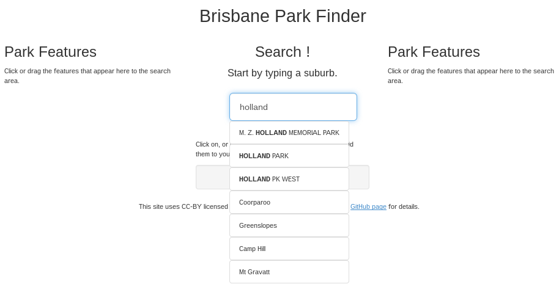
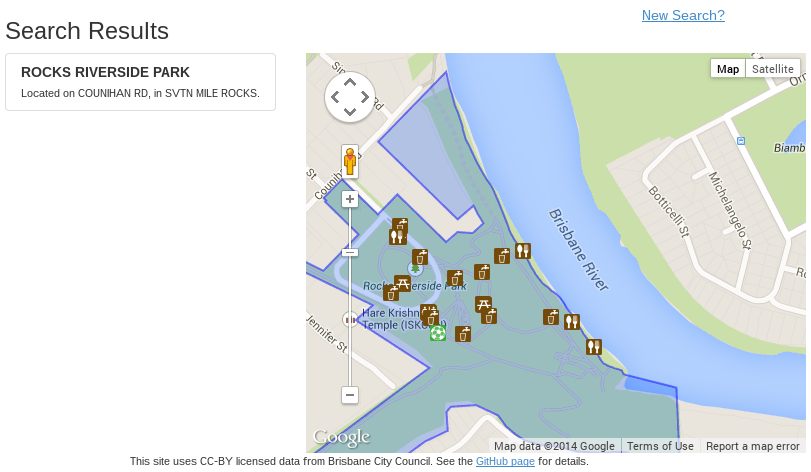
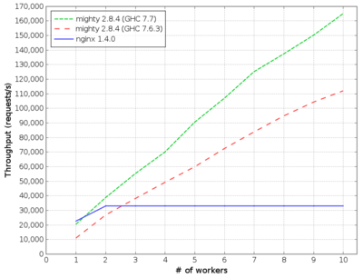

..
  Copyright 2014  Fraser Tweedale.

  This work is licensed under the Creative Commons Attribution 4.0
  International License. To view a copy of this license, visit
  http://creativecommons.org/licenses/by/4.0/.

************
Introduction
************

About me
========

- Developer at Red Hat.

- FreeIPA identity management and Dogtag PKI.

- Mostly Python and Java at work.

- Mostly Haskell at home.

This talk
=========

- Part experience report; part Haskell/functional programming
  advocacy; part open data advocacy.

- What is Haskell?

- Why Haskell?

- GovHack project implementation details; wins and pain points.

- Field guide to Haskell web technologies

The Haskell Programming Language
================================

- Functional programming language

- Strong, static type system

- Pure (no side-effects)

- Lazy (only evaluates expressions if/when needed)

- Performance

*Why* Haskell?
==============

- Type system prevents many kinds of programmer errors.

- Purity → *referential transparency* → *equational reasoning*

- Powerful, beautiful abstractions.  Don't repeat yourself!

- High-quality libraries and frameworks.

- *Why Functional Programming Matters*; Hughes 1984.
  http://www.cse.chalmers.se/~rjmh/Papers/whyfp.pdf

*******
GovHack
*******

GovHack
=======

- Annual open data event in Australia; weekend hackfest.

- Competition; do cool/useful things with newly-released
  data sets; prizes!

- All levels of govt involved; awesome that they are doing this;
  get behind it!

- Brisbane Functional Programming Group entered a team (3 people)

GovHack - deciding the project
==============================

- Shortlisted a handful of datasets.

- Assessed data sanity, formats/syntax and usefulness.

- Considered writing libraries to parse/convert peculiar formats
  used in various data sets (unusual date formats, etc)

- Eventually decided on...

GovHack - Brisbane Park Finder
==============================

- Search council parks in Brisbane by location and facilities.
  - *"Find a park near Chermside with BBQs and dog off-leash area"*

- View map of park and surrounds including boundary with facilities
  marked on map with icons.

- http://brisparks.info/
  - UX sucks; enter if you dare!

- https://github.com/bfpg/brisparks.info

GovHack - Brisbane Park Finder
==============================

GovHack - Brisbane Park Finder
==============================

**************
Implementation
**************

Implementation - importing data
===============================

- Most datasets were CSV.

- *cassava* library for parsing CSVs into custom data types.

- Elegant and type-safe.

Implementation - importing data
===============================

Data type representing a *park facility* CSV record:

.. code:: haskell

  data Facility = Facility
    { _facParkNumber :: Int
    , _facParkName   :: Text
    , _nodeId        :: Int
    , _nodeUse       :: Text
    , _nodeName      :: Text
    , _description   :: Text
    , _easting       :: Double
    , _northing      :: Double
    }

Implementation - importing data
===============================

*cassava*; CSV parser instance for ``Facility`` data type:

.. code:: haskell

  instance FromNamedRecord Facility where
    parseNamedRecord m = Facility
      <$> m .: "PR_NO"
      <*> m .: "PARK_NAME"
      <*> m .: "NODE_ID"
      <*> m .: "NODE_USE"
      <*> m .: "NODES_NAME"
      <*> m .: "DESCRIPTION"
      <*> m .: "EASTING"
      <*> m .: "NORTHING"

Implementation - importing data
===============================

*cassava*; import facilities from CSV:

.. code:: haskell

  importFacilities :: Postgres -> IO ()
  importFacilities db = do
    fileContents <- readFile "facilities.csv"
    case decodeByName fileContents of
      Left err ->
        putStrLn ("CSV parse error: " ++ err)
      Right facilities ->
        runWithDb (mapM_ insertFacility facilities) db

Implementation - database
=========================

*postgresql-simple* library; reading DB records:

.. code:: haskell

  instance FromRow Facility where
    fromRow = Facility
      <$> field
      <*> field
      <*> field
      <*> field
      <*> field
      <*> field
      <*> field
      <*> field

Implementation - database
=========================

*postgresql-simple* library; writing DB records:

.. code:: haskell

  instance ToRow Facility where
    toRow f =
      [ toField (f ^. facParkNumber)
      , toField (f ^. facParkName)
      , toField (f ^. nodeId)
      , toField (f ^. nodeUse)
      , toField (f ^. nodeName)
      , toField (f ^. description)
      , toField (f ^. easting)
      , toField (f ^. northing)
      ]

Implementation - database
=========================

*postgresql-simple* library; select facilities by park number:

.. code:: haskell

  getFacilities :: Int -> Db [Facility]
  getFacilities id = query
     [sql|
       SELECT
         park_number, park_name, node_id, node_use,
         node_name, description, easting, northing
       FROM park_facility f
       WHERE f.park_number = ?
     |]
     (Only id)    -- a single '?' param

Implementation - Snap Framework
===============================

- Haskell web framework
- Fast web server
- *Snaplets* to extend framework functionality
  - templating, authentication, session management, DB etc.

- Scaffolding for quick setup

Implementation - heist templating
=====================================

- *heist*; Snap templating system.

- Interpolation:
  - ``
``
  - ``<h4><parkName/></h4>``
  - ``
Located on <parkStreet/>, in <parkSuburb/>.
``

- Some sanity checks at *load* time.
  - ``mismatched tags; 
 found inside 
 tag``
  - I wish these were *compile errors*!

Implementation - JavaScript
===========================

- PureScript is a pure, strongly-typed Alt-JS.
  - Similar syntax to Haskell; similar expressiveness.
  - FFI for safe interaction with impure JavaScript environment.

- In keeping with strongly-typed FP theme, decided to do the
  front-end in PureScript.  One small problem...
  - Noone actually knew PureScript

- Eventually abandoned for raw JavaScript.

Retrospective
=============

- "Haskell just got out of the way; pain
  points were *other* things."

- "You can make changes at 3am; as long as the code is compiling
  you can come back and not be *too* afraid."

- Loss of type safety at database interface bit us a few times.

- PureScript: don't try to learn conceptually dense things *during*
  a hackfest.

- UX *sucked*; we needed someone with UX focus.

- Great fun.  Would Haskell again.  Bring on GovHack 2015.

***************************************
Field guide to Haskell web technologies
***************************************

Servers
=======

- WAI - Web Application Interface
  - à la Rack, WSGI et al.
  - Application, Middleware, Request, Response APIs
  - Used by several (not all) frameworks

- Warp (HTTP server)
  - The premier WAI handler
  - Fast

How fast is Warp?
=================

http://www.aosabook.org/en/posa/warp.html

Frameworks
==========

- Yesod
  - Type-safe routes, URLs, templates.
  - Scaffolding
  - http://www.yesodweb.com/

- Scotty
  - Microframework à la Sinatra.
  - https://github.com/scotty-web/scotty

- HappStack
  - http://happstack.com/docs/crashcourse/index.html

- Silk ``rest``
  - Define REST APIs; generate client libs; auto docs
  - Runs on Snap, HappStack or native WAI
  - https://silkapp.github.io/rest/

Deploying Haskell apps
======================

- Platform as a Service (PaaS)
  - OpenShift community cartridge
  - Heroku buildpack
  - FP Application Server (https://www.fpcomplete.com/)
  - http://www.haskell.org/haskellwiki/Web/Cloud
  - Lightning talk: http://is.gd/CNx0na

- Docker
  - Haskell/GHC images: https://registry.hub.docker.com/
  - No official *Language Stack* for Haskell yet.

- DIY

Summary
=======

- Open data is important, and fun!
  - You have useful skills, so get involved.  You might win $$$

- Functional programming matters.

- Lots of lessons learned in taking on GovHack in Haskell.
  - Haskell is great for rapid (web) app development.
  - FP + types + good libraries/frameworks = powerful combo.
  - Deployment options still a bit immature.
  - Don't neglect UX!

Resources
=========

- Learn Haskell: https://github.com/bitemyapp/learnhaskell
- Snap Quick Start Guide: http://snapframework.com/docs/quickstart
- PureScript by Example: https://leanpub.com/purescript/
- HaskellWiki: http://www.haskell.org/haskellwiki/Web
- GovHack: http://www.govhack.org/
- BFPG: http://bfpg.org ; #bfpg (Freenode)

Thanks for listening
====================

Copyright 2014  Fraser Tweedale

This work is licensed under the Creative Commons Attribution 4.0
International License. To view a copy of this license, visit
http://creativecommons.org/licenses/by/4.0/.

Slides
  https://github.com/frasertweedale/talks/
Email
  ``frase@frase.id.au``
Twitter
  ``@hackuador``

*********
Questions
*********
