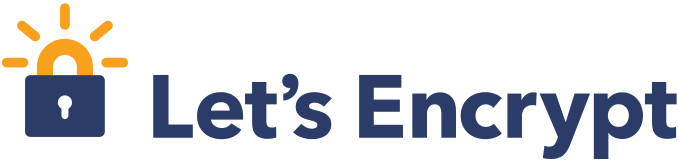

..
  Copyright 2015  Fraser Tweedale.

  This work is licensed under the Creative Commons Attribution 4.0
  International License. To view a copy of this license, visit
  http://creativecommons.org/licenses/by/4.0/.

Deploying TLS today
===================

#. Pay $$$ to a *certificate authority*
#. Prove control of domain (ad-hoc process)
#. Certificate request (various protocols)
#. Configure network server (non-trivial)

.. nbsp
 
=

Let's Encrypt!
==============

- Initiative to encrypt the whole web
- EFF, Mozilla, Akamai, Cisco, IdenTrust
- *Free* certificate authority
- ACME protocol

ACME protocol
=============

- *Automated Certificate Management Environment*
- Domain validation
- Certificate request, renewal, revocation
- Client configures web server

ACME domain validation challenges
=================================

- Host token at HTTPS resource (self-signed cert)
  - ``GET /.well-known/acme-challenge/...``

- SNI
  - Present self-signed cert for ``<computed>.acme.invalid``

- DNS
  - ``_acme-challenge.example.com. IN TXT "<token>"``

- Proof of possession of prior key

Deploying TLS with ACME
=======================

.. demo

Status
======

- Under heavy development
- Protocol still evolving
- Nginx configurator in the works
- Mid-2015 launch

Future
======

- More validation challenges (DNSSEC?)
- Other applications (S/MIME for email?)
- Support from other CAs?  Hopefully!

Get involved
============

- https://letsencrypt.org/
- https://github.com/letsencrypt/
- #letsencrypt on Freenode
- https://www.ietf.org/mailman/listinfo/acme
- client-dev+subscribe@letsencrypt.org
- ca-dev+subscribe@letsencrypt.org

Fin
===

Copyright 2015  Fraser Tweedale

This work is licensed under the Creative Commons Attribution 4.0
International License. To view a copy of this license, visit
http://creativecommons.org/licenses/by/4.0/.

Slides
  https://github.com/frasertweedale/talks/
Email
  ``ftweedal@redhat.com``
Twitter
  ``@hackuador``
