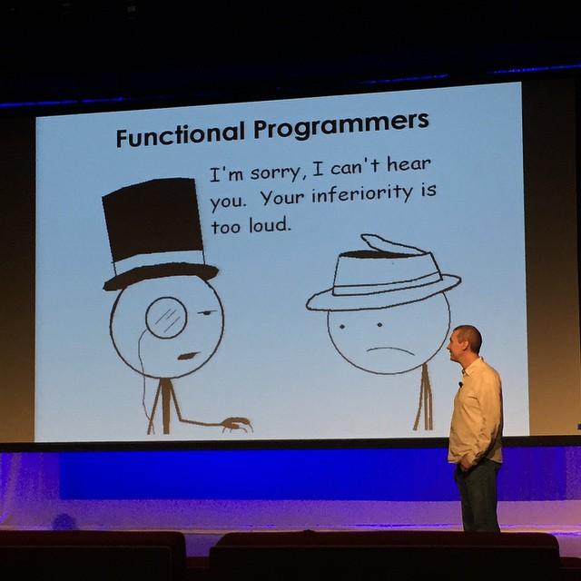

..
  Copyright 2015  Fraser Tweedale

  This work is licensed under the Creative Commons Attribution 4.0
  International License. To view a copy of this license, visit
  http://creativecommons.org/licenses/by/4.0/.

What is Functional Programming?
===============================

  - Computation as evaluation of functions

  - *Actual functions*

  - cf. imperative, OO (*non-functional*) programming

Applications of FP
==================

  - 100% academic; no real-world applications

  - Helps you feel superior to other programmers

Applications of FP
==================

linux.conf.au 2016
==================

- 1st - 5th February ; Geelong

- **Functional Programming Miniconf!** (2nd Feb)

- Miniconf-only tickets from $90.

- CFP: https://bfpg.github.io/fp-miniconf/cfp

Awesome speakers!
=================

- Katie Miller (Facebook)

- Tony Morris (Data61 / NICTA)

Fin
===

Copyright 2015  Fraser Tweedale

This work is licensed under the Creative Commons Attribution 4.0
International License. To view a copy of this license, visit
http://creativecommons.org/licenses/by/4.0/.

Slides
  https://github.com/frasertweedale/talks/
Email
  ``frase@frase.id.au``
Twitter
  ``@hackuador``
