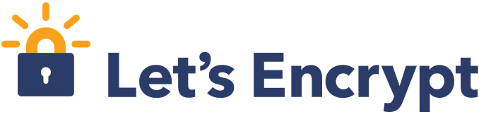

..
  Copyright 2015  Fraser Tweedale.

  This work is licensed under the Creative Commons Attribution 4.0
  International License. To view a copy of this license, visit
  http://creativecommons.org/licenses/by/4.0/.

Deploying TLS (today)
=====================

#. Pay $$$ to a *certificate authority*
#. Prove control of domain (ad-hoc process)
#. Certificate request (various protocols)
#. Configure network server (non-trivial)

.. nbsp
 
=

Let's Encrypt!
==============

- Initiative to encrypt the whole web
- EFF, Mozilla, Akamai, Cisco, IdenTrust
- *Free* certificate authority
- ACME protocol

ACME protocol
=============

- *Automated Certificate Management Environment*
- Domain validation
- Certificate request and renewal
- Server configuration

Deploying TLS (tomorrow)
========================

.. demo

Links
=====

- https://letsencrypt.org/
- https://github.com/letsencrypt/acme-spec

Fin
===

Copyright 2015  Fraser Tweedale

This work is licensed under the Creative Commons Attribution 4.0
International License. To view a copy of this license, visit
http://creativecommons.org/licenses/by/4.0/.

Slides
  https://github.com/frasertweedale/talks/
Email
  ``ftweedal@redhat.com``
Twitter
  ``@hackuador``
