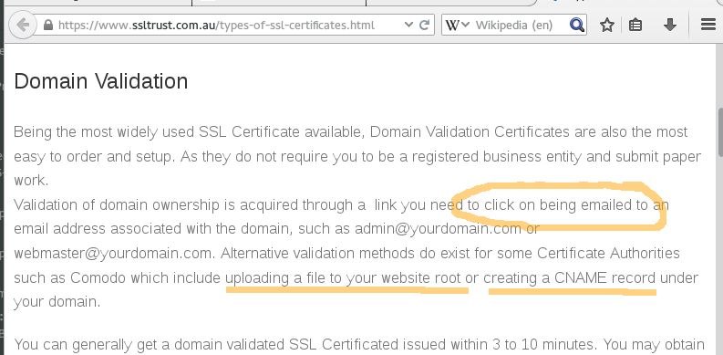
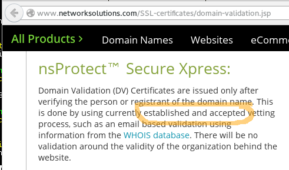

..
  Copyright 2015  Fraser Tweedale.

  This work is licensed under the Creative Commons Attribution 4.0
  International License. To view a copy of this license, visit
  http://creativecommons.org/licenses/by/4.0/.

************
Introduction
************

About me
========

- Developer at Red Hat

- *Dogtag Certificate System* and *FreeIPA IdM*

- Mostly Python and Java at work

- Mostly Haskell for other projects

This talk
=========

- Deploying TLS (today)

- Introduction to *Let's Encrypt!* initiative and *ACME* protocol

- Demo

- Discussion; future directions

*************
Deploying TLS
*************

Deploying TLS
=============

0. Pay $$$ to a *certificate authority*
1. Prove control of domain (ad-hoc process)
2. Certificate request (various protocols)
3. Configure network server (non-trivial)

Domain validation
=================

Domain validation
=================

Certificate request
===================

- ``openssl req -nodes -newkey rsa:2048 -sha1 -keyout myserver.key
  -out server.csr`` LOL WAT

- Make sure you put the right info in the right fields...

- *"Open the 'server.csr' file with a text-editor and copy and paste
  the contents into the enrollment form when requested."*

Server configuration
====================

- Certificate chain configuration >_<

- Default TLS config suboptimal or outright insecure

- Out of date info on web

- ``ssl_ciphers EECDH+ECDSA+AESGCM:EECDH+aRSA+AESGCM:EECDH+ECDSA+SHA384:EECDH+ECDSA+SHA256:EECDH+aRSA+SHA384:EECDH+aRSA+SHA256:EECDH:EDH+aRSA:!aNULL:!eNULL:!LOW:!3DES:!RC4:!MD5:!EXP:!PSK:!SRP:!DSS;`` LOL WAT

.. nbsp
 
=

.. image:: letsencrypt-logo-horizontal-ARTIFACT.png

Let's Encrypt!
==============

- Initiative to encrypt the whole web
- EFF, Mozilla, Akamai, Cisco, IdenTrust
- *Free* certificate authority
- ACME protocol

Let's Encrypt! non-goals
========================

- Not a replacement for X.509 PKI or certificate cartel

- Not intended for automating / replacing higher forms of validation

- Not intended to be useful in private / institutional uses of X.509
  PKI

ACME protocol
=============

- *Automated Certificate Management Environment*

- Domain validation challenges and responses

- Certificate request, renewal, revocation

- ACME client configures web server

ACME overview
=============

- Generate account key pair

- Satisfy DV challenge(s) to authorize account key for a domain

- Issue and revoke certificates using authorised account key

- REST-ish API

- Client request objects signed with account key (JWS)

ACME key registration
=====================

::

  POST /new-reg HTTP/1.1

  { "contact": [ "mailto:cert-admin@example.com", ... ] }
  /* Signed as JWS by account key */

- ``contact`` URIs used for recovery and/or notifications

- ``Location`` header in response to allow client to ``POST``
  updated contact details

ACME key authorisation
======================

::

  POST /new-authz HTTP/1.1

  { "identifier": {
      "type": "dns",
      "value": "example.org" } }
  /* Signed as JWS by account key */

ACME key authorisation
======================

::

  { "status": "pending",
    "identifier": { /* as above */ },
    "key": { /* JWK from JWS header */ },
    "challenges": [
      { "type": "simpleHttps",
        "uri": "/authz/foo/0",
        "token": "IlirfxKKXAsHtmzK29Pj8A" },
      { "type": "dns",
        "uri": "/authz/foo/1",
        "token": "IlirfxKKXAsHtmzK29Pj8A" },
      { "type": "recoveryToken",
        "uri": "/authz/foo/2" } },
    "combinations": [ [0,2], [1,2] ] }

ACME domain validation challenges
=================================

``simpleHttps``: deploy HTTPS resource

``dvsni``: sign custom certificate for use with SNI

``dns``: provision DNS TXT record

``proofOfPossession``: proof control of already-trusted key

``recoveryContact``: verify previously-authorized client using contact details

``recoveryToken``: verify previously-authorized client by previously issued token

ACME DV: ``simpleHttps``
========================

::

  { "type": "simpleHttps",
    "token": "evaGxfADs6pSRb2LAv9IZf17Dt3juxGJ+PCt92wr+oA" }

  { "type": "simpleHttps",
    "path": "6tbIMBC5Anhl5bOlWT5ZFA" }

- Provision a file with content of ``token``

  - ASCII, >= 128 bits of entropy

- Host at ``.well-known/acme-challenge/<path>``

  - ``text/plain``

- Self-signed certificate (CN is hostname being validated)

ACME DV: ``dvsni``
==================

::

  { "type": "dvsni",
    "r": "Tyq0La3slT7tqQ0wlOiXnCY2vyez7Zo5blgPJ1xt5xI",
    "nonce": "a82d5ff8ef740d12881f6d3c2277ab2e" }

  { "type": "dvsni",
    "s": "9dbjsl3gTAtOnEtKFEmhS6Mj-ajNjDcOmRkp3Lfzm3c" }

- ``r``, ``s``: random 32-byte octet strings, base64-encoded
- ``nonce``: random 16-byte octet string, hex-encoded
- Provision *host* on server

  - Hostname: ``<nonce>.acme.invalid``

- Self-signed certificate; ``subjectAltName`` with two ``dNSName``s
  - *domain being validated*
  - ``<hex(sha256(r || s))>.acme.invalid``

ACME DV: ``dns``
================

::

  { "type": "dns",
    "token": "17817c66b60ce2e4012dfad92657527a" }

  { "type": "dns" }

- ``token``: string; SHOULD be random with >= 128 bits entropy

- Provision TXT record for domain being validated

  - ``_acme-challenge.<domain>. IN TXT "<token>"``

ACME DV: ``proofOfPossession``
==============================

::

  { "type": "proofOfPossession",
    "alg": "RS256",
    "nonce": "eET5udtV7aoX8Xl8gYiZIA",
    "hints": {
      "jwk": { ... },
      "certFingerprints": [ ... ],
      "subjectKeyIdentifiers": [ ... ],
      "serialNumbers": [ ... ],
      "issuers": ["O=Trusted LLC,CN=Trustworthy Public CA"]
      "authorizedFor": ["example.com", "example.net"] } }

  { "type": "proofOfPossession",
    "nonce": "vOxx8LyGzIaiAE8teU5TD7",
    "signature": { ... } }

ACME DV: ``proofOfPossession``
==============================

- ``signature``: custom construction (not JWS)

- signing input: ``client-nonce || server-nonce``

- Proves possession of a key *already-trusted* by ACME server

- ``hints``: all fields are optional except ``jwk``

ACME certificate issuance
=========================

::

  POST /new-cert HTTP/1.1

  { "csr": "5jNudRx6Ye4HzKEqT5...FS6aKdZeGsysoCo4H9P",
    "authorizations": [ "/authz/foo/0", ...  ] }
  /* Signed as JWS by account key */

- CSR is PKCS #10 DER, base64-encoded

- Can request certificate for *multiple* validated identifiers
  (``subjectAltName`` ``extensionRequest`` attributes)

- If successful...

  - Respond 201

  - MUST include ``Location`` header, e.g. ``/cert/<serial>``

  - MAY include certificate (``application/pkix-cert``)

ACME certificate revocation
===========================

::

  POST /cert/<serial> HTTP/1.1

  { "revoke": "now",
    "authorizations": [ ... ] }
  /* Signed as JWS by account key */

- ``revoke``: RFC 3339 date, or literal ``"now"``

- Server MAY instead accept signature by certificate key

****
Demo
****

Let's Encrypt! Status
=====================

- Client and server under heavy development

- ACME protocol still evolving

- Nginx configurator in the works

- Mid-2015 launch

Protocol evolution
==================

- Original protocol was RPC-based

- Moving to REST-ish interface

- Does this change security characteristics?

  - More HTTP resources means more places to check auth[nz]

- Switch from custom signature construction to JWS

******
Future
******

Adoption
========

I would like to see:

- Support for all popular HTTP servers

- Support from multiple public CAs (even paid ones)

- Uptake by PaaS and IaaS providers / software

Other validation challenges
===========================

- DNSSEC

- Email (for MTAs?)

- WHOIS

Other applications
==================

- Validation for other kinds of *identifiers*?

- MUAs; validate email address and acquire S/MIME certificate

Side-effects
============

- Better server configuration mechanisms / APIs (yay!)

- CA cartel probably won't like it!

  - Countermeasures (EV, all over again?)

  - Attacks (against Let's Encrypt! CA or ACME protocol)

Get involved
============

- https://letsencrypt.org/
- https://github.com/letsencrypt/
- #letsencrypt on Freenode
- https://www.ietf.org/mailman/listinfo/acme
- client-dev+subscribe@letsencrypt.org
- ca-dev+subscribe@letsencrypt.org

Fin
===

Copyright 2015  Fraser Tweedale

This work is licensed under the Creative Commons Attribution 4.0
International License. To view a copy of this license, visit
http://creativecommons.org/licenses/by/4.0/.

Slides
  https://github.com/frasertweedale/talks/
Email
  ``frase@frase.id.au``
Twitter
  ``@hackuador``
