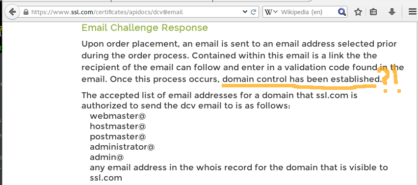

..
  Copyright 2015  Fraser Tweedale.

  This work is licensed under the Creative Commons Attribution 4.0
  International License. To view a copy of this license, visit
  http://creativecommons.org/licenses/by/4.0/.

*************
Deploying TLS
*************

Deploying TLS
=============

#. Pay $$$ to a *certificate authority*
#. Prove control of domain (ad-hoc process)
#. Certificate request (various protocols)
#. Configure network server (non-trivial)

Domain validation
=================

.. image:: dv-ssltrust.png

Domain validation
=================

.. image:: dv-networksolutions.png

Domain validation
=================

Certificate request
===================

- ``openssl req -nodes -newkey rsa:2048 -sha1 -keyout myserver.key
  -out server.csr`` LOL WAT

- Make sure you put the right info in the right fields...

- *"Open the 'server.csr' file with a text-editor and copy and paste
  the contents into the enrollment form when requested."*

Server configuration
====================

- Certificate chain configuration >_<

- Default TLS config suboptimal or outright insecure

- Out of date info on web

- ``ssl_ciphers EECDH+ECDSA+AESGCM:EECDH+aRSA+AESGCM:EECDH+ECDSA+SHA384:EECDH+ECDSA+SHA256:EECDH+aRSA+SHA384:EECDH+aRSA+SHA256:EECDH:EDH+aRSA:!aNULL:!eNULL:!LOW:!3DES:!RC4:!MD5:!EXP:!PSK:!SRP:!DSS;`` LOL WAT

.. nbsp
 
=

.. image:: letsencrypt-logo-horizontal-ARTIFACT.png

Let's Encrypt!
==============

- Initiative to encrypt the whole web
- EFF, Mozilla, Akamai, Cisco, IdenTrust
- *Free* certificate authority
- ACME protocol

Let's Encrypt! - what is it not?
================================

- Not a replacement for X.509 PKI or certificate cartel

- Not intended for automating / replacing higher forms of validation

- Not intended to be useful in private / institutional uses of X.509
  PKI

ACME protocol
=============

- *Automated Certificate Management Environment*
- Domain validation
- Certificate request, renewal, revocation
- ACME client configures web server

.. TODO talk about hooks for payment, etc.

ACME domain validation challenges
=================================

- TODO serious expansion needed

- Host token at HTTPS resource (self-signed cert)
  - ``GET /.well-known/acme-challenge/...``

- SNI
  - Present self-signed cert for ``<computed>.acme.invalid``

- DNS
  - ``_acme-challenge.example.com. IN TXT "<token>"``

- Proof of possession of prior key

Deploying TLS with ACME
=======================

.. demo

Status
======

- Under heavy development

- ACME is still evolving

- Nginx configurator in the works

- Mid-2015 launch

Protocol evolution
==================

- Original protocol was RPC-based

- Moving to REST-ish interface

- Does this change the security characteristics?

..
  Now a proliferation of resource paths

  Increase burden on ACME servers to ensure that information
  about (existence of) validations in progress does not leak?

  - Resource names must be random (unguessable)

  - Signatures over request data must be validated before checking
    whether resource exists to prevent timing attacks.

  - If ACME takes off and multiple implementations emerge, mistakes
    will be made.

On the plus side...
===================

- Using the switch to REST to make other changes

- Switching to JWS from custom signature format

- Some smart people are keeping an eye on ACME development

..
  original sig format was... not secure

  TODO include reference to Adam Langley (agl) bug report

******
Future
******

More validation challenges
==========================

- DNSSEC

- Email

- ???

Adoption
========

I would like to see:

- Support from multiple public CAs (even with payment)

- Support for popular network servers

- Uptake by PaaS and IaaS providers / software

Other applications
==================

- Validation automation for other kinds of *identities*?

- MUAs; validate email address and acquire S/MIME certificate

Get involved
============

- https://letsencrypt.org/
- https://github.com/letsencrypt/
- #letsencrypt on Freenode
- https://www.ietf.org/mailman/listinfo/acme
- client-dev+subscribe@letsencrypt.org
- ca-dev+subscribe@letsencrypt.org

Fin
===

Copyright 2015  Fraser Tweedale

This work is licensed under the Creative Commons Attribution 4.0
International License. To view a copy of this license, visit
http://creativecommons.org/licenses/by/4.0/.

Slides
  https://github.com/frasertweedale/talks/
Email
  ``frase@frase.id.au``
Twitter
  ``@hackuador``
