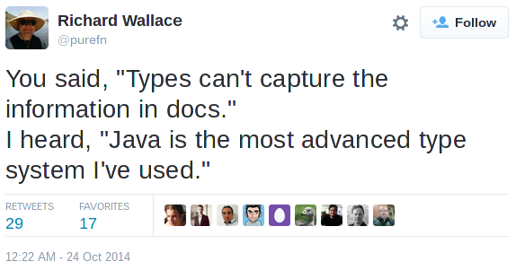
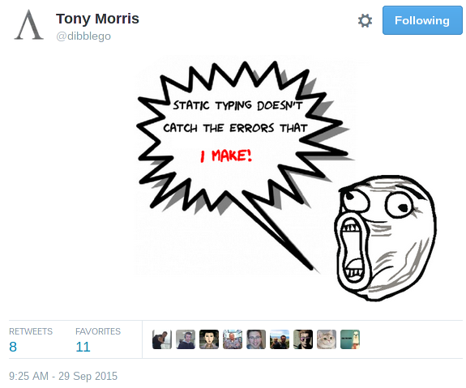
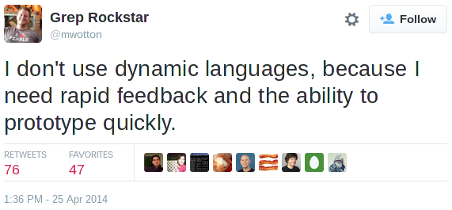
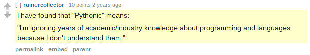
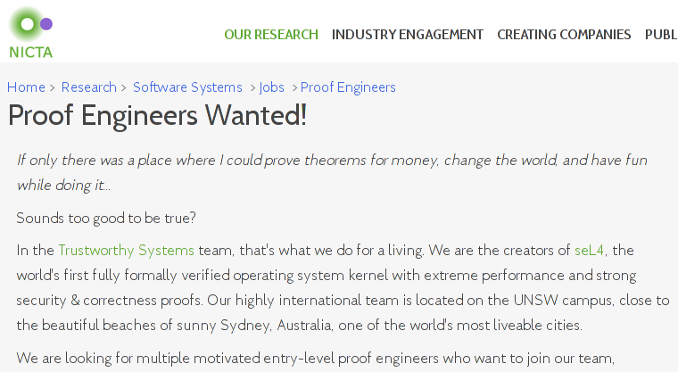

..
  Copyright 2015  Fraser Tweedale

  This work is licensed under the Creative Commons Attribution 4.0
  International License. To view a copy of this license, visit
  http://creativecommons.org/licenses/by/4.0/.

*****
Intro
*****

Target audience
===============

Software developers whose goals are:

- Correct software

- Maintainable software

- Still correct after maintenance

- *Move fast and* ***don't*** *break things*

Move fast and break things?
===========================

*“When you build something that you don't have to fix 10 times,
you can move forward on top of what you've built.*

*It may not be quite as catchy as 'move fast and break things'
but it's how we operate now.”*

- Mark Zuckerberg
- http://is.gd/vx3tgj

Outline
=======

- Principles and tools for the working programmer

- Lots of opinions
  - Mine, not my employer's

- Some facts

- May contain traces of unfamiliar syntax

- Manufactured on equipment that also processes tree nuts

***************
Language survey
***************

**************
On correctness
**************

Correctness
===========

- Doesn't matter *that much* right?

- "But I'm only ever going to write _______"
  - web things?  boring business logic?  games?

- Broken software has consequences

- Start caring; embrace the tools

Data modelling
==============

- Model data responsibly

- Do your research

  - *Falsehoods programmers believe about {names, time, ...}*

- Make illegal state unrepresentable

- Newtypes, `units of measure`_

- Immutability

.. _units of measure: https://en.wikibooks.org/wiki/F_Sharp_Programming/Units_of_Measure

************************
Dynamic vs static typing
************************

Dynamically typed languages
===========================

- Duck typing, type juggling, argh!
- Checking argument "types" is boring yet fraught
- Little help with program construction, refactoring
- Type checkers eliminate whole classes of errors *for free*
- Principled abstractions... where are they?

Criticisms of static typing
===========================

- Too verbose
- Types can't capture the information in docs
- Types can't catch all errors
- I need rapid feedback and the ability to prototype quickly
- But I *like* {Python, JavaScript, ...}!

Verbosity
=========

.. code:: python

  # Python
  print("Enter your name: ", end='')
  name = input()
  print("Hi, " + name)

.. code:: haskell

  -- Haskell
  main = do
    putStr "Enter your name: "
    name <- getLine
    putStrLn ("Hi, " ++ name)

Type system expressiveness
==========================

.. https://twitter.com/purefn/status/525291064350224385

Type system expressiveness
==========================

.. https://twitter.com/dibblego/status/648639711695646720

Prototyping
===========

.. https://twitter.com/mwotton/status/459536308809912320

Warm, fuzzy feelings
====================

..  https://www.reddit.com/r/programming/comments/1kq173/guido_van_rossum_explains_twisteds_deferreds/cbrnqn4

Type safety
===========

*“People first need to feel the pain of runtime errors to understand
why a type system is useful.”*

- Python aficionado

***************************
Why don't my programs work?
***************************

Escape hatches
==============

- null values
- type casing (``instanceof``)
- type casting
- exceptions
- general recursion
- side-effects (I/O, impure functions)

Trap
====

I know what you're thinking
===========================

  - How will I do X without feature Y?
    - How will I *reason about your program* to do X if you use Y?

  - What use is a program without side effects?
    - What use is a program with *uncontrolled side effects*?

  - What about algorithms that are *inherently stateful?*
    - They don't exist.  (`Church-Turing thesis`_)

  - It's fine, I've got this.
    - No you don't (and neither do I).
    - Apologise to your team mates and future-self right now.

.. _Church-Turing thesis: https://en.wikipedia.org/wiki/Church%E2%80%93Turing_thesis

Total languages
===============

- languages that guarantee program termination
- examples: Agda, Coq, Idris
- can express most programs (all that we care about in industry)
- most programmers are using non-total languages

Fast and loose reasoning
========================

- *reasoning about programs written in non-total langauges* ***as if they
  were written in a total language***.

- justified (mathematically) in `*Fast and loose reasoning is
  morally correct*`_, Danielsson et al. 2006

- costs nothing; you can write any program *without using escape
  hatches*

- and you gain
  - *composability*
  - *referential integrity*
  - *equational reasoning*
  - *reuse*

.. _*Fast and loose reasoning is morally correct*: http://www.cse.chalmers.se/~nad/publications/danielsson-et-al-popl2006.pdf

*************
Parametricity
*************

Parametric polymorphism (syntax)
================================

.. code:: java

  // Java generics
  static <A> List<A> f(List<A> xs) { ... }

.. code:: python

  # Python (with PEP 484 type hinting)
  def f(xs : List[T]) -> List[T]:
    ...

.. code:: haskell

  -- Haskell
  f :: [a] -> [a]
  f xs = ...

Parametric polymorphism
=======================

Two function signatures:

.. code:: haskell

  f :: [Int] -> [Int]
  g :: [ a ] -> [ a ]

- Which gives the programmer more information?

- Which is *better*?

******************
Theorems for Free!
******************

Parametricity
=============

*“Write down the definition of a polymorphic function on a piece
of paper.  Tell me its type, but be careful not to let me see
the function's definition.  I will tell you a theorem that the
function satisfies.”*

- `*Theorems for Free!*`_ Wadler 1989

Polymorphic types are:

- partial (sometimes complete) specifications
  - implementor cannot use any type-specific behaviour
  - caller has guarantee function will work for any type

- machine-checkable documentation

- a free source of useful theorems (***parametricity***)

.. _*Theorems for Free!*: http://homepages.inf.ed.ac.uk/wadler/papers/free/free.ps

Parametricity
=============

.. code:: haskell

  f :: [a] -> [a]

What does this function do?

  - reverse a list?

  - drop the first element?

  - ignore its argument return an empty list?

  - **Theorem:** every element in the output appears in the input

  - **Theorem:** ∀ g. map g ∘ f = f ∘ map g

Parametricity
=============

.. code:: haskell

  f :: a -> (a, a)

  g :: a -> a -> a

  h :: b -> a -> a

- https://twitter.com/parametricity

*******
Testing
*******

Testing
=======

- Who writes tests?

- Who *likes* writings tests?

- Ever missed a corner case?

Testing
=======

Recall our old friend:

.. code:: haskell

  f :: [a] -> [a]

- It turns out we *do* want ``f`` to reverse lists
- Alas! ``([a] -> [a])`` does not mean reverse

Testing
=======

.. code:: haskell

  ∀ x.     f [x] = [x]
  ∀ xs ys. f (xs ++ ys) = f ys ++ f xs
  f :: [a] -> [a]

- Now we're good.
- A minimal (yet complete) algebraic specification for list reversal

Property-based testing
======================

- write down properties of your functions
- tell the framework how to generate random values
- framework generates lots of data, tries to *falsify* properties
- *the best test data is random test data*
- `*QuickCheck: A Lightweight Tool for Random Testing of Haskell
  Programs*`_. Claessen and Hughes 2000
- Talk: https://youtu.be/TSDTDqoH_vM

.. _`*QuickCheck: A Lightweight Tool for Random Testing of Haskell Programs*`: http://www.eecs.northwestern.edu/~robby/courses/395-495-2009-fall/quick.pdf

Theorem proving
===============

- *the best test data is* ***no test data***
- proof assistants: Agda, Coq, Idris
- no proof, no program
- can prove correctness, equivalence, complexity, ...
- *program extraction* to other languages
- Idris talk/demo: https://youtu.be/4i7KrG1Afbk

Theorem proving
===============

*“Beware of bugs in the above code; I have only proved it correct,
not tried it.”*

- Donald Knuth

Theorem proving
===============

*“We are waiting for you to catch up, so we can employ you.”*

- anonymous, NICTA (data61)

***********
Wrapping up
***********

Excuses
=======

- But we are a {Java, C#, ...} shop!
- We won't be able to hire {Haskell, Scala, ...} devs!
- The academic-ness, it burns!

Languages
=========

- Scala_, Frege_, Clojure_, Ermine_ (JVM)
- `F#`_ (Common Language Infrastructure)
- Swift_ (iThings)
- Do you *really* need to stick to {JVM, CLI}?
- Haskell_, Rust_

.. _Scala: http://www.scala-lang.org/
.. _Frege: https://github.com/Frege/frege
.. _Clojure: http://clojure.org/
.. _Ermine: https://ermine-language.github.io/
.. _F#: http://fsharp.org/
.. _Swift: https://developer.apple.com/swift/
.. _Haskell: https://www.haskell.org/
.. _Rust: https://www.rust-lang.org/

Libraries
=========

- functionaljava_
- scalaz_
- swiftz_
- xsharpx_ (C#)

.. _functionaljava: http://www.functionaljava.org/
.. _scalaz: https://github.com/scalaz/scalaz
.. _swiftz: https://github.com/typelift/swiftz
.. _xsharpx: https://github.com/NICTA/xsharpx/

Resources
=========

- Brisbane Functional Programming Group
  - http://bfpg.org/
  - #bfpg on Freenode
  - or find an FP group in your city

- https://github.com/NICTA/course

- Software Foundations
  - Course on mathematical underpinnings of reliable software
  - http://www.cis.upenn.edu/~bcpierce/sf

Conclusion
==========

- Responsible modelling of data is paramount
- Types are your friend
- Avoid traps and use *fast and loose reasoning*
- Parametric polymorphism gives you theorems for free
- Algebraic properties → more thorough tests with less effort
- *Use the right tools*

Fin
===

Copyright 2015  Fraser Tweedale

This work is licensed under the Creative Commons Attribution 4.0
International License. To view a copy of this license, visit
http://creativecommons.org/licenses/by/4.0/.

Slides
  https://github.com/frasertweedale/talks/
Twitter
  `@hackuador`_
Email
  ``frase@frase.id.au``

.. _@hackuador: https://twitter.com/hackuador
