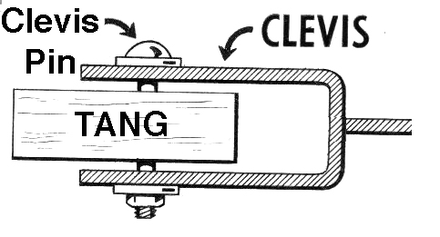

..
  Copyright 2016  Red Hat, Inc.

  This work is licensed under the Creative Commons Attribution 4.0
  International License. To view a copy of this license, visit
  http://creativecommons.org/licenses/by/4.0/.

*****
Intro
*****

A story
=======

- Machine in datacentre gets rebooted for patching

- Machine has full-disk encryption

- How to deliver decryption passphrase / KEK?

  - out-of-band management?

  - escrow?

Another story
=============

- Network daemon gets restarted

- Daemon needs to load TLS private key

- How to deliver decryption passphrase / KEK?

  - logged-in admin types it?

  - store private keys in clear? (!)

  - escrow?

Goals
=====

- Secrets are stored encrypted on disk

- Automated decryption of secrets when on secure network
  - secret is "bound to network"

- Secret is never divulged to another party

Assumptions
===========

- Network is secure

- Physical machines are secure

- Secret is safe in memory

Diffie-Hellman exchange
=======================

- Key agreement protocol

- Alice and Bob agree on a *shared secret*

- Eve cannot learn shared key

Integrated Encryption Scheme
============================

- Encryption protocol based on DH

- Derive *symmetric key* from shared secret

- Alice encrypts a message to Bob's public key; sends it

- Bob can decrypt the message, Eve cannot

McCallum-Relyea exchange
========================

- Encryption protocol based on IES

- Alice encrypts a message to Bob's public key; **doesn't send it**

- Alice discards her private key

- To decrypt, Alice asks Bob to encrypt an *ephemeral key* and uses
  the reply to to decrypt the secret.

- Eve cannot decrypt the message ***and neither can Bob!***

M-R - How does this even work?
==============================

- IES is *malleable*

- Integer addition mod :math:`n` and EC point addition *commute*

- Discrete logarithm in :math:`ℤ^*_p` and EC point factorisation in
  :math:`𝔽_q` are *hard problems*

- ∴ can "double-encrypt" a secret, and *decrypt in any order*

M-R - Parameters
================

- field :math:`𝔽` of size :math:`q`
- an elliptic curve :math:`E(𝔽_q)`
- base point :math:`g \in E(𝔽_q)` of order :math:`n`
- key derivation function :math:`KDF` (PBKDF2)
- symmetric encryption algorithm :math:`Enc` (AES-GCM)

M-R - Encryption
================

.. raw:: latex

  \begin{center}
  \def\arraystretch{1.5}%
  \begin{tabular}{ l l }
    \multicolumn{1}{c}{Client} & \multicolumn{1}{c}{Server} \\ \hline
    $A \in_R [1, n-1]$ & $B \in_R [1, n-1]$ \\
    & $b \gets g^B$ \\
    \multicolumn{2}{c}{$ \gets b $} \\
    $ K \gets KDF(b^A) = KDF(g^{AB}) $ & \\
    $ a \gets g^A, c \gets Enc(K, m)) $ & \\
  \end{tabular}
  \end{center}

M-R - Decryption
================

.. raw:: latex

  \begin{center}
  \def\arraystretch{1.5}%
  \begin{tabular}{ l l }
    \multicolumn{1}{c}{Client} & \multicolumn{1}{c}{Server} \\ \hline
    $X \in_R [1, p-1]$ & \\
    $ x \gets ag^X = g^Ag^X $ & \\
    \multicolumn{2}{c}{$ x \to $} \\
    & $x' \gets x^B = g^{AB}g^{XB} $ \\
    \multicolumn{2}{c}{$ \gets x' $} \\
    $ K \gets KDF(x'(b^X)^{-1}) $ & \\
    $ ~~~ = KDF(g^{AB}g^{XB}g^{-XB}) = KDF(g^{AB}) $ & \\
    $ m \gets Enc^{-1}(K, c) $ & \\
  \end{tabular}
  \end{center}

Tang
====

- Server-side daemon and *Clevis pin*

- C

- Extensive test suite

- Small and fast (>30k req/sec)

- Nearing stable release

Tang - protocol
===============

- UDP

- ASN.1 (DER)

- No encryption (none needed)

- Trust On First Use (TOFU)
  - Signed messages allow key rotation
  - OOB fingerprint validation / key pinning are possibilities

Tang - threats and caveats
==========================

- MitM on first use could cause client to encrypt to bogus
  recovery key

- A single Tang server is DoS target

- Good entropy needed for :math:`X`

- Quantum computing

History
=======

- Feb '15: *Deo* project begins (*δεω, to bind*)

  - Used TLS for privacy and X.509 encryption cert (*complexity!*)

  - Server decrypts and returns secret (thus learning it; *bad!*)

- Sep '15: M-R discovered; rewrite begins

- Dec '15: Project split into Tang and Clevis

To what other things can we bind secrets?
=========================================

- TPM
- Smartcard
- Bluetooth LE beacon
- Biometrics
- "Master unlock key"

Unlock policy
=============

- Security is not binary

- Policy should be driven by business needs, *not technology*

- How can we support arbitrarily complex unlock policy? e.g.

  - :math:`stage1 \gets S \subset \{ pwd, tang, smartcard, fingerprint \}, |S| \ge 2`
  - :math:`stage2 \gets \{ stage1, tpm \}`
  - :math:`unlock \gets S \subset \{ stage2, pwd \}, |S| \ge 1`

Shamir's Secret Sharing
=======================

- :math:`k` points describe a polynomial of degree :math:`k - 1`

- Free coefficient :math:`\gets` secret, other coefficients
  :math:`\gets_R`

- Distribute :math:`n` points (:math:`n \ge k, x \ne 0`)

- Given :math:`k` points, compute *Lagrange polynomial*
  - secret :math:`\gets f(0)`

Shamir's Secret Sharing
=======================

.. raw:: latex

  \begin{center}
  \def\svgwidth{.8\columnwidth}
  \input{Lagrange_polynomial-ARTIFACT.pdf_tex}
  \end{center}
  \tiny

CC BY-SA 3.0 https://en.wikipedia.org/wiki/File:Lagrange_polynomial.svg

Clevis
======

- Client-side, pluggable key management based on SSS
- *pins* (plugins)
  - tang, password, https, ...

- JSON configuration
- Few dependencies (openssl, libjansson)

Clevis - terminology
====================

.. raw:: latex

  \centering

******************
Show me the shiny!
******************

Clevis - status
===============

- Under active development
- In progress:
  - early boot integration (LUKS)
  - key rotation

Resources
=========

- https://github.com/npmccallum/tang

- https://github.com/npmccallum/clevis

- https://github.com/npmccallum/deo/wiki

- Blog post on Apache integration: https://is.gd/hQcpuM

How to help
===========

- Crypto review

- Protocol review

- Code review

- Testing

- Contribute Clevis *pins*!

Fin
===

Copyright 2016  Red Hat, Inc.

This work is licensed under the Creative Commons Attribution
Share-Alike 4.0
International License. To view a copy of this license, visit
http://creativecommons.org/licenses/by-sa/4.0/.

Slides
  https://github.com/frasertweedale/talks/
Twitter
  `@hackuador`_
Email
  ``ftweedal@redhat.com``

.. _@hackuador: https://twitter.com/hackuador
