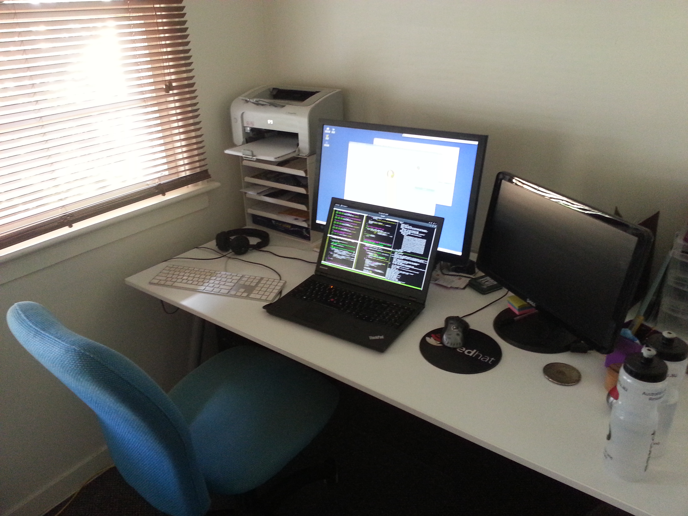

..
  Copyright 2016  Fraser Tweedale

  This work is licensed under the Creative Commons Attribution 4.0
  International License. To view a copy of this license, visit
  http://creativecommons.org/licenses/by/4.0/.

********************
What is remote work?
********************

..
  - You work on project
  - *Project* based elsewhere/nowhere
  - Geographic / *temporal* separation
  - Not: WFH 1 or 2 days per week and such like
  - Not: Remote but onsite e.g. 1 week per month.

My work situation
-----------------

.. raw:: latex

  \begin{center}
  \resizebox{0.9\paperwidth}{!}{
    \input{Simple_world_map_au-ARTIFACT.pdf_tex}
  }
  \end{center}

My work situation
-----------------

.. raw:: latex

  \begin{center}
  \resizebox{0.9\paperwidth}{!}{
    \input{Simple_world_map_au_cz_us-ARTIFACT.pdf_tex}
  }
  \end{center}

My work situation
-----------------

.. raw:: latex

  \begin{center}
  \resizebox{0.9\paperwidth}{!}{
    \input{Simple_world_map_all-ARTIFACT.pdf_tex}
  }
  \end{center}

How does this work?
-------------------

- Email (direct, mailing lists)
- Chat (IRC / Slack / etc)
- Collaborative documents (Etherpad / Google docs / wiki)
- Meetings (video chat / screen sharing / Google Hangout)

********
Joys
********

***********
Flexibility
***********

Convenience
-----------

.. save time (no commute), save $$$, tax benefits

****
Flow
****

.. Fewer interruptions

Travel
------

.. raw:: latex

  \tiny

CC BY-SA 2.0 https://www.flickr.com/photos/skinnylawyer/5562822079/

.. Might have more opportunity to travel

**********
Trials
**********

Work/life balance
-----------------

.. raw:: latex

  \tiny

CC BY-SA 2.0 https://www.flickr.com/photos/quinnanya/5892760393/

**********
Onboarding
**********

.. ramp-up is super hard - noone is at hand to help you get
  started.  This was hardest thing for me; look me a long time
  before I felt like I was productive

*****************
Communication
*****************

..
  - Can't interrupt anyone when you need a quick answer/review/etc
  - Easy to be ignored / patches languish unreviewed / easy to
    ignore email
  - Meetings at odd hours
  - Firefighting at odd hours

  - you can be working hard with little progress; have to make an
    extra effort to communicate your progress/let people know what
    you're working on and where you're up to.

******************************
What's in it for the employer?
******************************

..
  - get the talent you need wherever it is
  - follow-the-sun support/work
  - greater diversity on offer
    - WFH may mean you can employ women, disabled persons,
      foreigners more easily
  - smaller overheads
  - happier employees = more productive?
  - lower turnover

********************
Is remoting for you?
********************

***************
Landing the gig
***************

**********
Questions?
**********

Fin
---

.. raw:: latex

  \begin{columns}

    %\begin{column}{.4\textwidth}
    %  \includegraphics[width=1.2\textwidth]{clevis.jpg}
    %\end{column}

    \begin{column}{.7\textwidth}

      \setlength{\parskip}{.5em}

      { \centering

      \input{cc-by-ARTIFACT.pdf_tex}

      \copyright~2016  Fraser Tweedale

      { \scriptsize
      Except where otherwise noted this work is licensed under
      }
      { \footnotesize
      \textbf{http://creativecommons.org/licenses/by/4.0/}
      }

      }

      \begin{description}
      \item[Twitter]
      \texttt{@hackuador}
      \item[Blog]
      \texttt{blog-ftweedal.rhcloud.com}
      %\item[Email]
      %\texttt{ftweedal@redhat.com}
      \end{description}
    \end{column}

  \end{columns}
